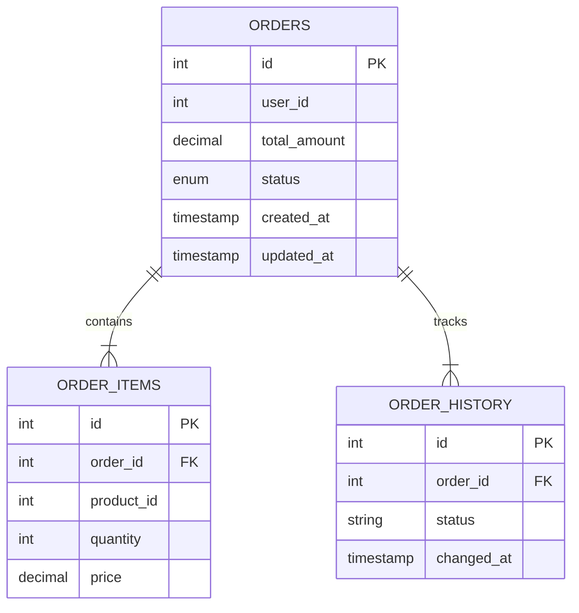
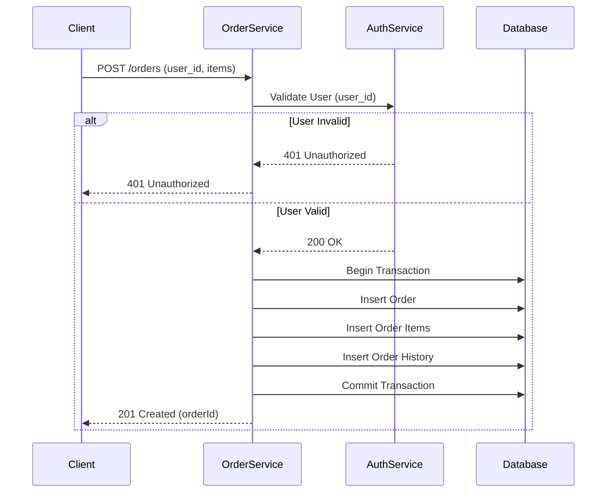

# Order Management Microservice

## Overview
This service handles the full lifecycle of orders, including creation, status updates, cancellation, and history tracking.

## Database Schema



## Sequence Diagram: Create Order



## API Specification

### 1. Create Order
- **Endpoint**: `POST /orders`
- **Body**:
  ```json
  {
    "user_id": 1,
    "items": [
      { "product_id": 101, "quantity": 2, "price": 50.00 }
    ]
  }
  ```
- **Response**: `201 Created`

### 2. Get User Orders
- **Endpoint**: `GET /orders?user_id=1`
- **Response**: `200 OK` (List of orders)

### 3. Get Order Details
- **Endpoint**: `GET /orders/:id`
- **Response**: `200 OK` (Order details + items + history)

### 4. Update Order Status
- **Endpoint**: `PATCH /orders/:id/status`
- **Body**: `{ "status": "SHIPPED" }`
- **Response**: `200 OK`

### 5. Cancel Order
- **Endpoint**: `DELETE /orders/:id`
- **Response**: `200 OK`
